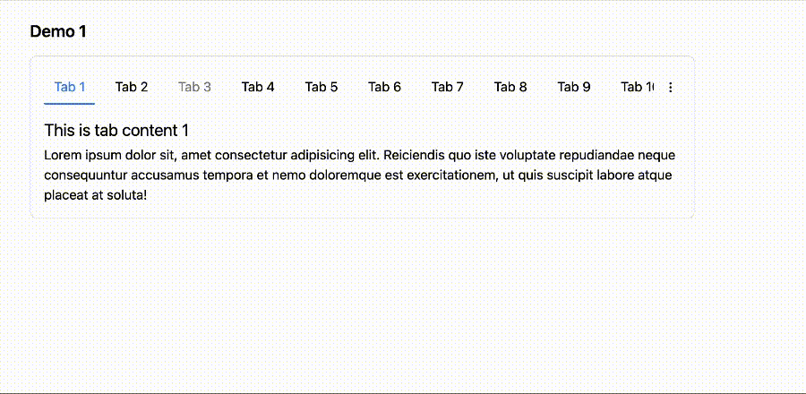

# Super Vue 3 Tabs Component

A Vue 3 component for creating tabbed interfaces easily.
### Try live demo [here](https://mdsaban.com/packages/super-vue3-tabs-component/demo/). If you face any issue, please raise it [here](https://github.com/mdsaban/super-vue3-tabs/issues/new).


## Installation
```bash
npm i super-vue3-tabs
```
or use yarn
```bash
yarn add super-vue3-tabs
```

## Usage
In your Vue 3 project, import the component where you need to use it:

```javascript
import { Tabs, Tab } from 'super-vue3-tabs';
```

**Tabs Component** - The Tabs component wraps your tab elements. It manages the state of the tabs and their content.

**Tab Component** - The Tab component represents each individual tab. It requires a title prop for the tab title and can contain any content.

```vue
<template>
  <Tabs>
    <Tab value="Tab 1">
      <p>This is the content of Tab 1</p>
    </Tab>
    <Tab :disabled="true" value="Tab 2">
      <p>This is the content of Tab 2</p>
    </Tab>
    <Tab value="Tab 3">
      <p>This is the content of Tab 3</p>
    </Tab>
  </Tabs>
</template>

<script setup>
import { Tabs, Tab } from 'super-vue3-tabs'
</script>
```

### Icon slots

You can also pass icons to the tabs using the `icon` slot. The icon will be displayed before the tab title.

```vue
<template>
  <Tabs>
    <Tab value="Tab 1">
      <template #icon>
        <i class="fas fa-home"></i>
      </template>
      <p>This is the content of Tab 1</p>
    </Tab>
    <Tab value="Tab 2">
      <template #icon>
        <i class="fas fa-user"></i>
      </template>
      <p>This is the content of Tab 2</p>
    </Tab>
    <Tab value="Tab 3">
      <template #icon>
        <i class="fas fa-cog"></i>
      </template>
      <p>This is the content of Tab 3</p>
    </Tab>
  </Tabs>
```

### Using Event & V-model

You can use the `change` event to listen to tab changes and the `v-model` to bind the active tab value.

```vue
<template>
  <Tabs @change="tabChanged" v-model="activeTab">
    <Tab value="Tab 1">
      <p>This is the content of Tab 1</p>
    </Tab>
    <Tab value="Tab 2">
      <p>This is the content of Tab 2</p>
    </Tab>
    <Tab value="Tab 3">
      <p>This is the content of Tab 3</p>
    </Tab>
  </Tabs>
</template>

<script setup>
import { Tabs, Tab } from 'super-vue3-tabs'

const activeTab = ref('Tab 1')

const tabChanged = (tab) => {
  console.log('Tab changed to', tab)
}
</script>
```

## Props

### Tabs Component
| Prop | Type | Default | Description |
| --- | --- | --- | --- |
| v-model | String | - | Current Tab's value |
| themeColor | String | #3b82f6 | Theme color of the tab, pass hexcode for custom color |


### Tab Component
| Prop | Type | Default | Description |
| --- | --- | --- | --- |
| value | String | - | The title of the tab. |
| disabled | Boolean | false | Whether the tab is disabled. |
| id | String | - | The html id of the tab. |

## Events

### Tabs Component

| Event | Description |
| --- | --- |
| change | Emitted when the active tab changes. The event payload is the index of the new active tab. |

### Tab Component
TODO: add event for tab 
<!-- 
| Event | Description |
| --- | --- |
| click | Emitted when the tab is clicked. The event payload is the index of the tab. |
 -->
